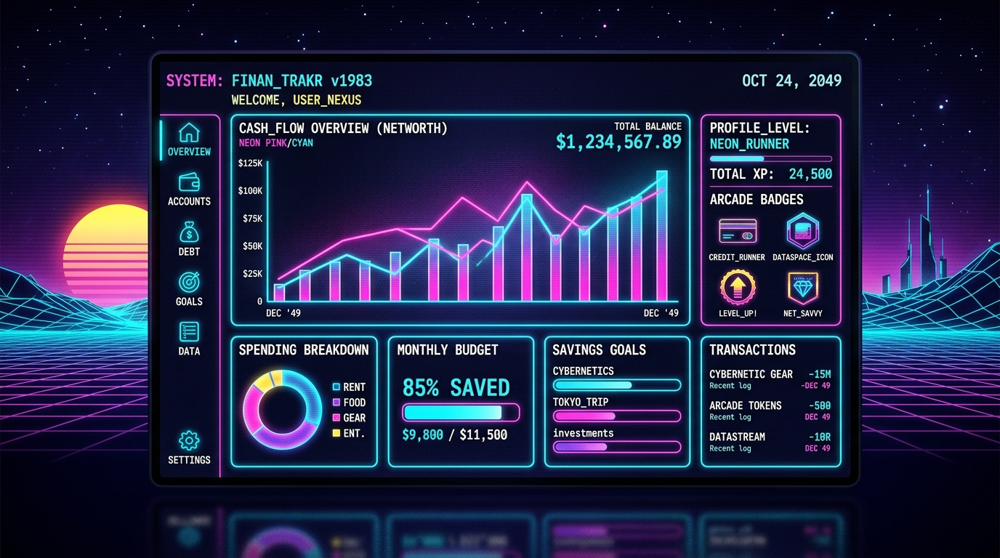

# ⚡ NEON VAULT // OKANE
### *Vaporwave Personal Finance Tracker & Arcade Architecture*



<p align="center">
  
  
  
  
</p>

---

## 🌌 Overview

**NEON VAULT** is an interactive, highly engaging personal finance management web application designed in an authentic **1980s Vaporwave / Synthwave** aesthetic. Built to make tracking monthly expenses and savings fun, non-boring, and gamified.

---

## ✨ Features Walkthrough

### 1. 📊 Command Center Dashboard
- **Net Vault Balance & Cashflow Metrics**: Live tracking of Net Savings, Total Income, Monthly Outflows, and Cyber Savings Rate %.
- **Glowing Visual Analytics (Recharts)**:
  - *Category Spending Breakdown*: Interactive Donut Chart.
  - *Budget Cap vs Actual Spend*: Neon comparison bar charts.
- **A.U.R.O.R.A. AI Financial Oracle**: Real-time cybernetic financial advisor providing dynamic savings tips based on your spending metrics.

### 2. 📝 Transaction Ledger
- Complete transaction history table with type indicators (Income vs Expense), category color tags, dates, and notes.
- Quick search & category filtering.
- Full entry log, edit, and deletion features with audio sound feedback.

### 3. 🎯 Category Budget Vault & Savings Goals
- **Monthly Category Caps**: Set spend limits per category with live visual progress bars (Cyan <70% → Yellow 70-99% → Blinking Red Over-Budget Warning).
- **Savings Goal Matrix**: Long-term targets (Emergency Fund, Tech Upgrades, Tokyo Trip) with interactive deposit buttons (+50 XP per deposit).

### 4. 🧠 Finance & Market Trends Quiz Arena
- **Interactive Finance Trivia**: Quizzes covering:
  1. *Compound Interest & Time Horizons*
  2. *Market Trends 2026 & Inflation Hedging*
  3. *50/30/20 Budgeting Rules & Silent Subscription Hacks*
- Detailed educational explanations after each question +100 Cyber XP rewards upon completion.

### 5. 🕹️ Retro Arcade Mini-Games (60 FPS HTML5 Canvas)
- **Budget Defender**: Retro space shooter where you shoot down impulse buying asteroids while collecting glowing savings crystals.
- **Savings Catcher**: Move your vault pad left and right to catch green savings coins while dodging red impulse traps.
- Score converts directly into Cyber XP!

### 6. 🏆 Leveling & Achievement Badges
- **5 Cyber Saver Ranks**: From *Neon Novice* (Lvl 1) up to *Vaporwave Tycoon* (Lvl 5).
- **Badges Gallery**: Unlockable badges for first entries, quiz mastery, high scores, and budget discipline.

### 7. 🔊 8-Bit Retro Audio Synthesizer & CRT Scanlines
- **Web Audio API**: Procedural 8-bit arcade chimes, lasers, explosions, and fanfares (no external MP3 asset dependency).
- **CRT Scanline Overlay**: Toggle retro monitor CRT scanlines on/off with a single button.

---

## 🛠️ Tech Stack

- **Frontend Framework**: React 19 + Vite 6
- **Styling**: Tailwind CSS v4 + Custom Cyberpunk Glow CSS Effects
- **Fonts**: Inter (Legible body copy), Orbitron (Retro futuristic headers), Share Tech Mono
- **Icons**: Lucide React
- **Charts**: Recharts
- **Audio**: Web Audio API (Synthesized 8-bit sound engine)
- **Effects**: Canvas Confetti & HTML5 Canvas 2D Context
- **Data Privacy**: 100% `localStorage` client-side persistence (Zero external servers)

---

## 🚀 Quick Start & Installation

1. **Clone the repository**:
   ```bash
   git clone https://github.com/Lixx-webdev/okane-neon-vault.git
   cd okane-neon-vault
   ```

2. **Install dependencies**:
   ```bash
   npm install
   ```

3. **Start local development server**:
   ```bash
   npm run dev
   ```

4. Open `http://localhost:5173` in your browser!

---

## 🔒 Data & Privacy

All financial data, ledger entries, savings goals, quiz scores, and high scores are stored **100% locally** in your browser's `localStorage`. You can export full JSON backups or reset to defaults anytime directly from the header controls.
